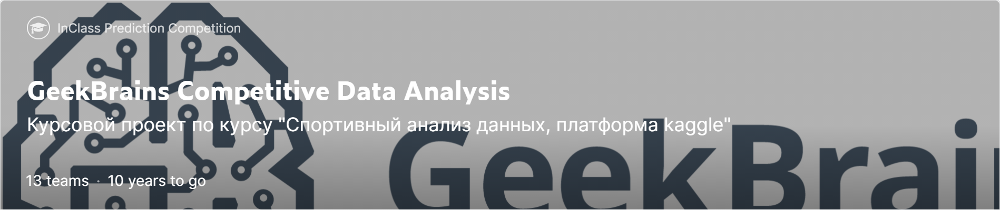

# Репозиторий посвящен треку: спортивный анализ данных Платформа Kaggle (Geek University)
[GeekBrains Competitive Data Analysis](https://www.kaggle.com/c/geekbrains-competitive-data-analysis)

---
### Inclass notebook will be uploaded after end of course (6-oct)...........

--- 
### Практическая часть

## Содержание

#### [1. Raw_Data_EDA](https://github.com/Nickel-nc/GU_Sport_DS/tree/master/1.%20Raw_Data_EDA)
- Explanatory Data Analysis samples.

#### [2. Validation_Setup](https://github.com/Nickel-nc/GU_Sport_DS/tree/master/2.%20Validation_Setup)
- Отработка различных способов валидации. **Hold-Out Validation 2 splits**, **Hold-Out Validation 3 splits**, **BootStrap validation**, **Adversarial Validation**, **KFold Validation**.

#### [3. Feature Engineering](https://github.com/Nickel-nc/GU_Sport_DS/tree/master/3.%20Feature%20Engineering)
- Практика отбора и генерации фич. **datetime processing**, **groups derivative**, **frequency encoding**, **PCA feature generation**.

#### [4. Model Optimization](https://github.com/Nickel-nc/GU_Sport_DS/blob/master/4.%20Stacking%20and%20Optimize/Model%20Stacking%20and%20Optimization.ipynb)
- Сравнение качества различных комбинаций моделей. **Stacking**, **Bagging**, **Weighted mean/geometric mean/ mean ranking**, **Correlation between predicitons**.

### [Class_Notebooks]()
- **Блокноты из вебинаров** с бейзлайнами, описанием технологий, стратегий, подходов к решению

