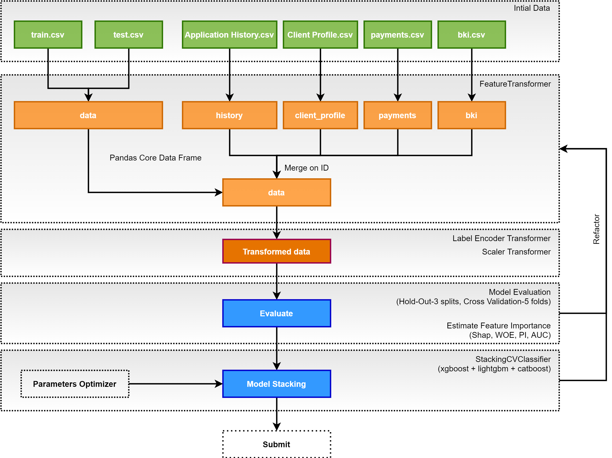

# Репозиторий посвящен треку: спортивный анализ данных Платформа Kaggle (Geek University)
[GeekBrains Competitive Data Analysis](https://www.kaggle.com/c/geekbrains-competitive-data-analysis)

## Содержание:
- Решение сорервнования
- Практическая часть

---
### [Блокнот с решением](https://github.com/Nickel-nc/GU_Sport_DS/blob/master/Kernels/Solution.ipynb)

### Схема Data Flow

#### Общая стратегия:

**Особенности данных:**
- train/test пустые датасеты с наборами ID, к которым мержились признаки.
- client profile - выгрузка характеристик пользователей с привязкой по ID. Мердж 1 к 1. Здесь лежат наиболее важные признаки.
- history, bki, payments. Данные по кредитной истории, платежам, в т.ч. из других кредитных организаций с привязкой по ID. На каждого пользователя среднем, около 10 записей.

Тестирование проводилось по forward feature selection: к пустому датасету последовательно добавлялось и тестировалось несколько новых признаков. На практике, наиболее влияющие на скор признаки сосредоточены в клиентском профиле.

Всего структура решения переписывалась 3 раза :)

#### Основной прирост качества обеспечен следующими вариантами:
- отсеивание множества слабых признаков, зашумляющих результат;
- стэкинг моделей (xgb, catb, lgbm);
- feature engineering - использование комбинаций, PCA, группировки, производные от наиболее качественных фич;

#### Прочие протестированные гипотезы, без особого результата:
- предсказание пропущенных значений (в т.ч. для наиболее значимых признаков);
- добавление NN-модели с полносвязными слоями, дропаутом и регуляризацией;
- калибровка параметра class_weights модели;
- увеличение сложности модели, уменьшение larning rate при увеличенном количестве итераций обучения;
- подход с генерацией признаков пачками (до 600), с последующим тестированием и выборочным отбрасыванием;

--- 
### Практическая часть

#### [1. Raw_Data_EDA](https://github.com/Nickel-nc/GU_Sport_DS/tree/master/1.%20Raw_Data_EDA)
- Explanatory Data Analysis samples.

#### [2. Validation_Setup](https://github.com/Nickel-nc/GU_Sport_DS/tree/master/2.%20Validation_Setup)
- Отработка различных способов валидации. **Hold-Out Validation 2 splits**, **Hold-Out Validation 3 splits**, **BootStrap validation**, **Adversarial Validation**, **KFold Validation**.

#### [3. Feature Engineering](https://github.com/Nickel-nc/GU_Sport_DS/tree/master/3.%20Feature%20Engineering)
- Практика отбора и генерации фич. **datetime processing**, **groups derivative**, **frequency encoding**, **PCA feature generation**.

#### [4. Model Optimization](https://github.com/Nickel-nc/GU_Sport_DS/blob/master/4.%20Stacking%20and%20Optimize/Model%20Stacking%20and%20Optimization.ipynb)
- Сравнение качества различных комбинаций моделей. **Stacking**, **Bagging**, **Weighted mean/geometric mean/ mean ranking**, **Correlation between predicitons**.

### [Class_Notebooks]()
- **Блокноты из вебинаров** с бейзлайнами, описанием технологий, стратегий, подходов к решению

